# Believers Sword

<div align="center">

**A Bible study companion for reading, prayer, notes, highlights, and deeper daily devotion.**

[](https://github.com/JenuelDev/Believers-Sword/releases/latest)
[](https://www.electronjs.org/)
[](https://vuejs.org/)
[](./LICENSE)

<br />
<br />


</div>

> "Your word is a lamp to my feet and a light to my path."
>
> Psalm 119:105

<div align="center">
  
</div>

## Overview

Believers Sword is a desktop Bible app built to help believers stay close to Scripture throughout the day. It combines Bible reading, study tools, notes, highlights, prayer tracking, sermons, and offline-friendly access in one focused experience.

## Downloads

Desktop downloads are published through GitHub Releases. Microsoft Store installs are also available for Windows users.

- Windows installer: `NSIS` setup package
- Windows Portable: no-install portable executable
- macOS: `DMG`
- Linux: `AppImage`
- Microsoft Store: Store-managed Windows installation and updates

If a direct asset link changes on a future release, use the latest releases page:

- https://github.com/JenuelDev/Believers-Sword/releases/latest

## Features

- Read multiple Bible translations in a focused reader
- Highlight verses and organize them by color
- Create notes and clip notes while studying
- Save bookmarks for quick return
- Manage prayer lists and answered prayers
- Use Study Space to keep research organized
- Search verses quickly across installed modules
- Listen with audio and TTS features
- Explore commentary and verse comparison tools
- Work offline with local resources

## Screenshots

### Desktop

<div align="center">
  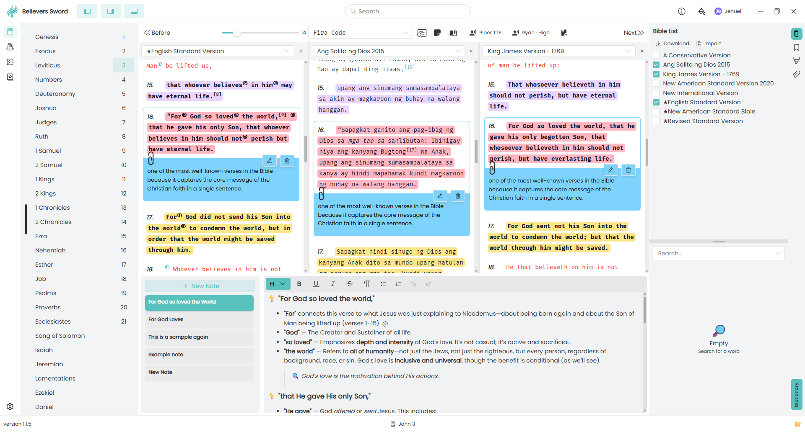
  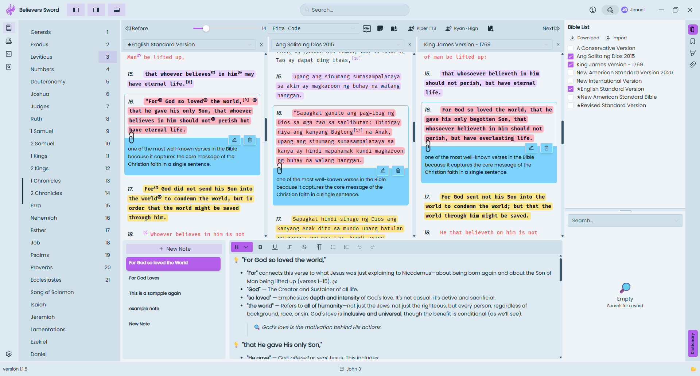
  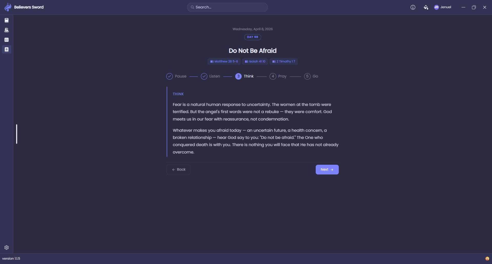
</div>

<div align="center">
  
  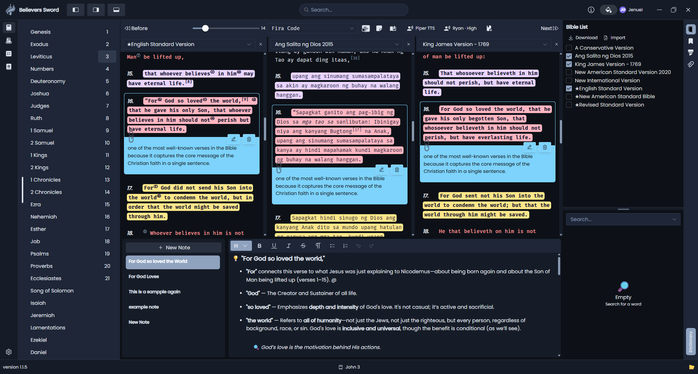
  
</div>

<div align="center">
  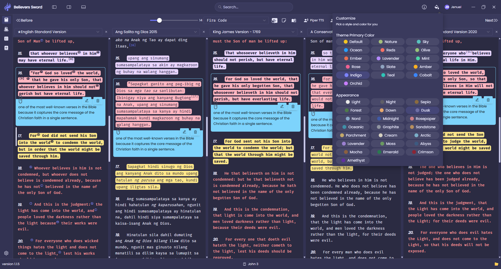
  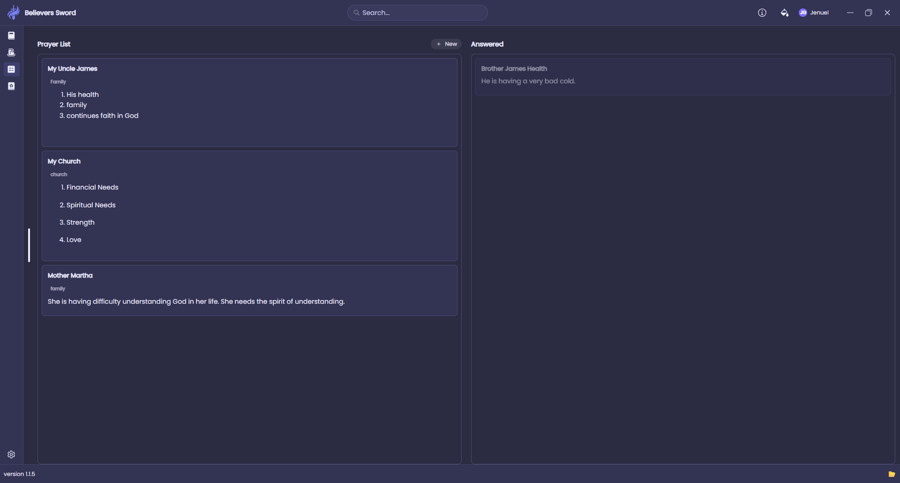
  
</div>

<div align="center">
  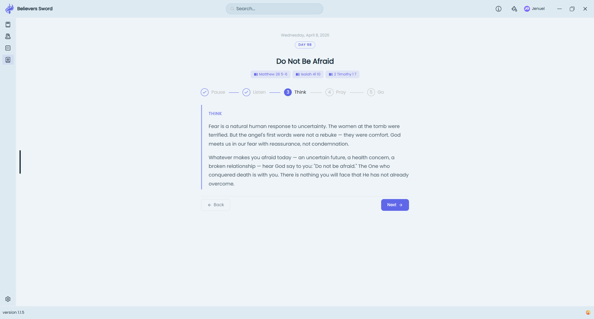
</div>

### Mobile

<div align="center">
  
  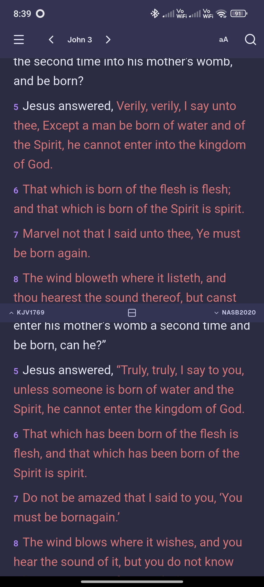
  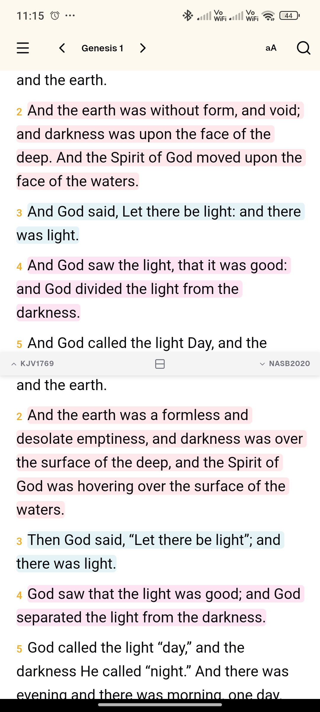
  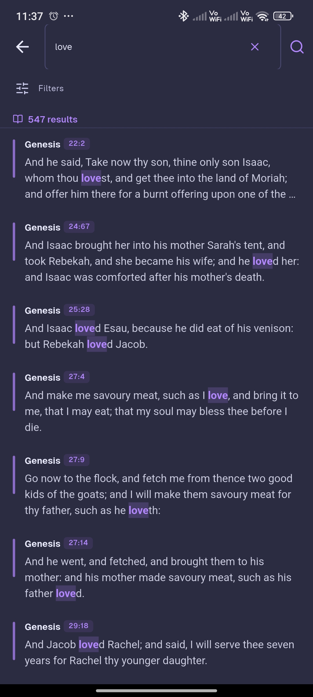
</div>

<div align="center">
  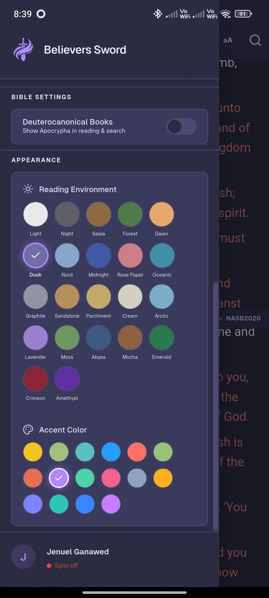
  
  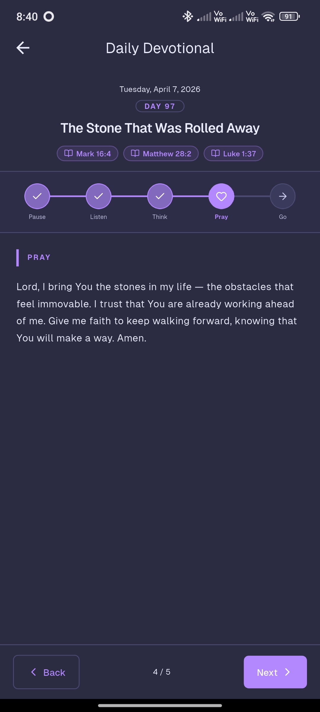
  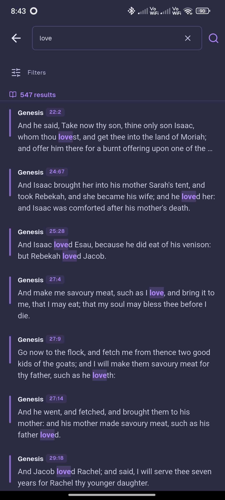
</div>

## System Requirements

- Windows 10 or newer
- macOS build support when release assets are published
- Linux support through `AppImage`
- 2 GB RAM minimum
- Around 500 MB of free storage recommended

## Development

### Prerequisites

- Node.js
- Yarn

### Setup

```bash
git clone https://github.com/JenuelDev/Believers-Sword.git
cd Believers-Sword
yarn setup
```

### Run locally

```bash
yarn start
```

### Build desktop packages

```bash
yarn app:build
```

### Build Microsoft Store package

```bash
yarn app:build:msix
```

## Support

If the app blesses you and you want to support development:

<div align="center">

[](https://buymeacoffee.com/jenuel.dev)

</div>

- One-time donation: https://buymeacoffee.com/jenuel.dev
- Membership: https://buymeacoffee.com/jenuel.dev/membership
- GitHub Sponsors: https://github.com/sponsors/JenuelDev

## Contributing

Contributions are welcome.

1. Fork the repository.
2. Create a branch for your change.
3. Commit your work.
4. Push the branch.
5. Open a pull request.

### PR Labels

When opening a pull request, please add one of the following labels so your change is categorized correctly in the release notes:

| Label | Use when |
|---|---|
| `feature` or `enhancement` | Adding new functionality |
| `bug` or `fix` | Fixing a bug |
| `improvement`, `refactor`, or `performance` | Improving existing code without adding features |
| `documentation` or `docs` | Updating documentation only |

**Examples:**

- Adding a new "verse of the day" feature → label: `feature`
- Fixing a crash when opening bookmarks → label: `bug`
- Speeding up Bible module loading → label: `performance`
- Updating the README → label: `docs`

If no label is added, your PR will appear under "Other Changes" in the release notes.

## License

This project is licensed under the GPL-3.0 license. See [LICENSE](./LICENSE).
